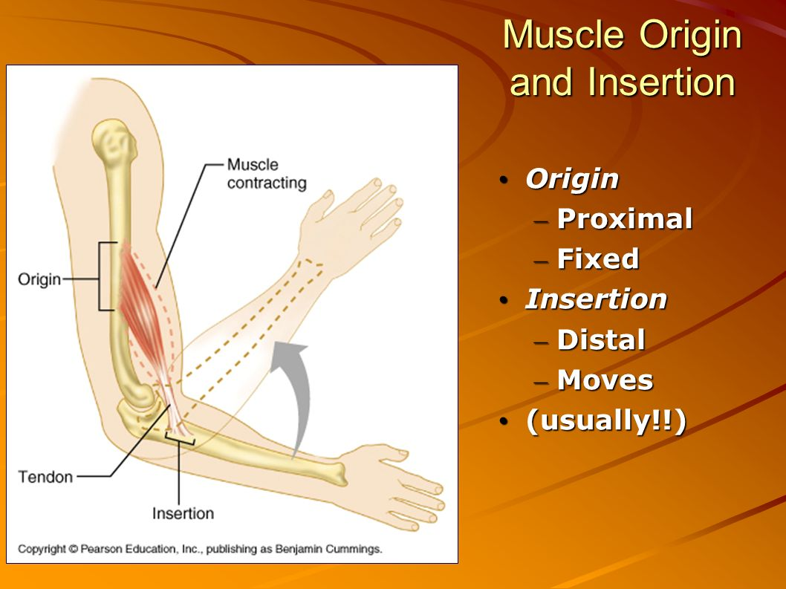
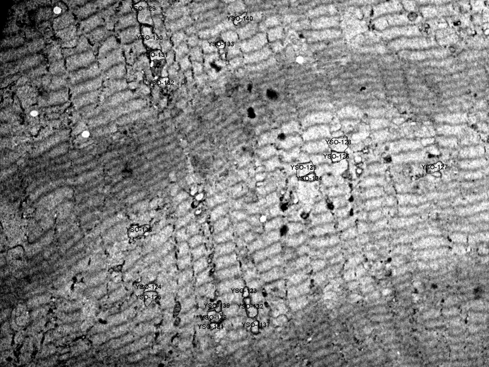

## <u>Overview</u>
1. Story about Size-Biased Data
2. Scientific Background for Mitochondria
3. Goals for this project: 
    * Whether Properties of mitochondria are different by locations. 
    * Suggestions on sampling scheme for future research. 
4. How Size-Biased Mitochondria Data came from? (Sampling Process)
5. Simulation Study 
6. Permutation Hypothesis Test and Boostrapping Confidence Interval 
7. Conclusion
8. Discussion 

--- .class #id 

## <u>Story about Size-Biased Data</u>
<br />
<br />


--- .class #id 

## <u>Scientific Background for Mitochondria</u>
<center>

</center>

--- .class #id 

## <u>Goals for this project: </u>

1. Whether Properties (area, perimeter, circularity and aspect ratio) of mitochondria are different by locations (proximal, middle and distal end). 
2. Suggestions on sampling scheme for future research. 

<center>

</center>

--- .class #id 

## <u>Sampling Process - 1</u>
* A young muscle fiber cell was magnifired to 166 different images by using Transmission Electron Microscope (TEM). 
* Those falls in <b>" { "</b> are defined as beging in <b>Proximal end</b>, in <b>" [ "</b> are being in <b>Distal end</b>, and the rest are being in <b>Middle part</b>.
</br><br />


--- .class #id 

## <u>Sampling Process - 2</u>
* For each location, divide images into two groups: Subsarcolemmanl and Interfibrillar group. 
* In each group, randomly pick one image.

--- .class #id 

## <u>Sampling Process - 3</u>
* In each image, randomly pick <b>20 mitochondria</b>. 
* Generate a list of random coordinates. 
* Pick the mitochondria whose area in the photo includes one or more generated coordinates. 
</br><br/>
<center>

</center>

--- .class #id 

## <u>Raw Data</u>

```{r, echo=FALSE, message=FALSE, warning=FALSE, results= "asis", include=FALSE}
# remove.packages('plotly')
# remove.packages('ggplot2')
# devtools::install_github('hadley/ggplot2')
# devtools::install_github("ropensci/plotly")
# install_github('ramnathv/slidify', ref = github_pull(425))
# pkgs = c('slidify', 'slidifyLibraries', 'rChart', 'ggplot2')
# install_github(pkgs, 'ramnathv', ref = 'dev')
# update.packages("plotly")
# update.packages("ggplot2")
# library(devtools)
library(devtools)
library(slidify)
library(slidifyLibraries)
library(ggplot2)
library(plotly)
library(DT)

# options(gvis.plot.tag="chart")
datt=read.csv("/Users/chou/Google Drive/UMN2014-2016/Spring2016/Plan B/final/clean_dat.csv",header=TRUE)
dat = datt[,-c(1,4,5)]
names(dat) = c("Sample ID", "# in image", "image No.", 
                "image name", "location", "PMD", "SI", 
                "Area", "Perimeter", "Circularity",
                "Aspect Ratio")
d=datatable(dat)
htmlwidgets::saveWidget(as_widget(d), file = "dat.html")
```
<iframe src="dat.html" allowtransparency="true"></iframe>

--- .class #id 

## <u>Problems</u>
1. It is not random sample. 
2. The larger mitochondria are easier to be picked in our sample. 
3. It is size-biased! 

--- .class #id 

## <u>Goals for this project: </u>
1. <font color="red"> What is the appropriate estimator for the size-biased data? </font> <br />
<font color = "green"><b>A: Simulation Study.</b></font>

2. Whether Properties (area, perimeter, circularity and aspect ratio) of mitochondria are different by locations (proximal, middle and distal end). <br />
<font color = "green"><b>A: Permutation Test and Boostrapping Confidence Interval.</b></font>

3. Suggestions on sampling scheme for future research.<br />
<font color = "green"><b>A: Based on the Simulation Study. </b></font>

--- .class #id 

## <u>Data Exploration: </u>
* <b>Area $({\mu m}^{2})$:</b> <br />
  The area occupied by a mitochondrion in an image. 
* <b>Perimeter $(\mu m)$:</b> <br />
  The length of the boundary of a mitochondrion in an image.
* <b>Circularity: </b><br />
Circularity is equal to $\frac{4 \pi Area}{Perimeter^2}$. <br /> 
(Measuring the resemblance of a mitochondrion to a circle. The range of circularity is     between 0 and 1.  1 means a perfect circle.)
* <b>Aspect Ratio:</b> <br />
  Aspect Ratio is equal to $\frac{Length}{Width}$. <br />
  (If $AR \leq 2$, it is considered short; if $2 < AR \leq 4$, intermediate; if $AR > 4$, long.)

--- &twocol #id 

## <u>Data Exploration: Area</u>
```{r echo=FALSE, message=FALSE, warning=FALSE, results= "asis", include=FALSE}
hist_PMD_a=ggplot(datt, aes(x=Area, color=PMD, fill=PMD))+
  geom_histogram(aes(y=..density..), alpha=0.5,
                 position="identity")+
  geom_density(alpha=.3)
box_PMD_a=ggplot(datt, aes(x=PMD, y=Area, fill=PMD)) + 
  geom_boxplot() +
  geom_point(position = position_jitter(h=0,w=0.3))

p1 <- ggplotly(hist_PMD_a)
htmlwidgets::saveWidget(as_widget(p1), file = "hist_a.html")
p2 <- ggplotly(box_PMD_a)
htmlwidgets::saveWidget(as_widget(p2), file = "box_a.html")
```

*** =left width:50%
<iframe src="hist_a.html" allowtransparency="true"></iframe>

*** =right width:50%
<iframe src="box_a.html" allowtransparency="true"></iframe>

--- &twocol #id 

## <u>Data Exploration: Perimeter</u>
```{r echo=FALSE, message=FALSE, warning=FALSE, results= "asis", include=FALSE}
hist_PMD_p=ggplot(datt, aes(x=Perimeter, color=PMD, 
                            fill=PMD))+ 
  geom_histogram(aes(y=..density..), alpha=0.5, 
                 position="identity")+
  geom_density(alpha=.2) 
box_PMD_p=ggplot(datt, aes(x=PMD, y=Perimeter, fill=PMD)) +
  geom_boxplot()+
  geom_point(position = position_jitter(h=0,w=0.3))

p1_p <- ggplotly(hist_PMD_p)
htmlwidgets::saveWidget(as_widget(p1_p), file = "hist_p.html")
p2_p <- ggplotly(box_PMD_p)
htmlwidgets::saveWidget(as_widget(p2_p), file = "box_p.html")
```


*** =left width:50%
<iframe src="hist_p.html" allowtransparency="true"></iframe>

*** =right width:50%
<iframe src="box_p.html" allowtransparency="true"></iframe>

--- &twocol #id 

## <u>Data Exploration: Circularity</u>

```{r echo=FALSE, message=FALSE, warning=FALSE, results= "asis", include=FALSE}
hist_PMD_c=ggplot(datt, aes(x=Circularity, color=PMD, 
                            fill=PMD))+ 
  geom_histogram(aes(y=..density..), alpha=0.5, 
                 position="identity")+
  geom_density(alpha=.2) 
box_PMD_c=ggplot(datt,aes(x=PMD,y=Circularity,fill=PMD)) + 
  geom_boxplot()+
  geom_point(position = position_jitter(h=0,w=0.3))

p1_c <- ggplotly(hist_PMD_c)
htmlwidgets::saveWidget(as_widget(p1_c), file = "hist_c.html")
p2_c <- ggplotly(box_PMD_c)
htmlwidgets::saveWidget(as_widget(p2_c), file = "box_c.html")
```

*** =left width:50%
<iframe src="hist_c.html" allowtransparency="true"></iframe>

*** =right width:50%
<iframe src="box_c.html" allowtransparency="true"></iframe>

--- &twocol #id 

## <u>Data Exploration: Aspect Ratio</u>
```{r echo=FALSE, message=FALSE, warning=FALSE, results= "asis", include=FALSE}
hist_PMD_ar=ggplot(datt, aes(x=Aspect.Ratio, color=PMD,
                             fill=PMD))+ 
  geom_histogram(aes(y=..density..), alpha=0.5, 
                 position="identity")+
  geom_density(alpha=.2) 

box_PMD_ar=ggplot(datt, aes(x=PMD, y=Aspect.Ratio, 
                            fill=PMD)) + 
  geom_boxplot()+
  geom_point(position = position_jitter(h=0,w=0.3))
 
p1_ar <- ggplotly(hist_PMD_ar)
htmlwidgets::saveWidget(as_widget(p1_ar), file = "hist_ar.html")
p2_ar <- ggplotly(box_PMD_ar)
htmlwidgets::saveWidget(as_widget(p2_ar), file = "box_ar.html")
```

*** =left width:50%
<iframe src="hist_ar.html" allowtransparency="true"></iframe>

*** =right width:50%
<iframe src="box_ar.html" allowtransparency="true"></iframe>

--- &twocol #id 

## <u>Data Exploration: Scatter Plots</u>
```{r echo=FALSE, message=FALSE, warning=FALSE, results= "asis", include=FALSE}
a.per=ggplot(datt, aes(x = Area, y = Perimeter))+
  geom_point()
a.cir=ggplot(datt, aes(x = Area, y = Circularity))+
  geom_point()
a.ar=ggplot(datt, aes(x = Area, y = Aspect.Ratio))+
  geom_point()

p = ggplotly(a.per)
g = subplot(ggplotly(a.per), ggplotly(a.cir), 
            ggplotly(a.ar), shareX = TRUE, titleY=TRUE, 
            margin = 0.08)


gg = subplot(ggplotly(a.cir), ggplotly(a.ar), nrows = 2, 
             shareX = TRUE, titleY = TRUE)

htmlwidgets::saveWidget(as_widget(g), file = "scatter.html")
htmlwidgets::saveWidget(as_widget(gg), file = "scatter_c_ar.html")
htmlwidgets::saveWidget(as_widget(p), file = "scatter_p.html")
```

<iframe src="scatter.html" width="200" height="200"></iframe>

--- &twocol #id 
## <u>Weighted Distribution</u>
* Cox (1962) proposed an idea of Weighted Distribution,
$${f}^{\ast}(x)=\frac{w(x)f(x)}{{E}_{f}(w(x))}$$

--- .class #id
## <u>Candidate Estimators - Area</u>
  1. Arithmetic Mean (AM) $$\frac{\sum_{i=1}^{n}{a}_{i}}{n}$$
  2. Weighted Mean (WM) 
  $$\frac{\sum_{i=1}^{n}{w}_{i}{a}_{i}}{\sum_{i=1}^{n}{w}_{i}}= \frac{n}{\sum_{i=1}^{n}\frac{1}{{a}_{i}}}$$
  3. Maxima Likelihood Estimator (MLE) 
$$\frac{\sum_{i=1}^{n}{a}_{i}}{2n}=\frac{AM}{2}$$

---

## <b>Simulation Study - Area</b> <br /> 
  * Suppose that the true distribution of  $Area\;\sim\;Exp(\theta)$. <br />
  * The observed distribution of $Area\;\sim\;Gamma(2,\hat{\theta})$. 
<br />
  * The red dash line is $Gamma(2, \hat{\theta}),$ where $\hat{\theta} = \bar{a} = 1183$ 

```{r echo=FALSE, message=FALSE, warning=FALSE, results= "asis"}
p1=ggplot(datt, aes(x=Area))+ 
  geom_histogram(aes(x=Area,y=..density..),color="black",fill="darkgrey")+
  stat_density(position="identity",geom="line",size=1)+
  stat_function(fun=dgamma, colour="red",args =list(shape=2,scale=1183),size=1,
                linetype = "dashed")

p1 = ggplotly(p1)
htmlwidgets::saveWidget(as_widget(p1), file = "area.html")
```
change the size of the graph
<iframe src="area.html"></iframe>

--- .class 

## <u>Simulation Study - Area</u>

1. Set $N = 2000$; Ratio between $N$ and $n$ are $(5\%, 10\%, 30\%, 50\%, 70\%, 95\%)$; $Repeated Times = 1000$ and $\mu = 1000$.
2. Generate $N$ samples from $Exp(\mu)$ as subpopulation of Area and calculate subpopulation mean, $\mu_A$, as the known parameter.
3. Sample a set of samples with size n from subpopulation with sampling probability proportional to the value of Area with and without replacement. $n$ is the product of $N$ and a certain Ratio.

--- .class 

## <u>Results of Simulation Study - Area</u>

plot for sampling with and without replacement 


--- 

## <u>Candidate Estimators - Perimeter</u>
  1. Arithmetic Mean (AM)
  $$\frac{\sum_{i=1}^{n}{p}_{i}}{n}$$
  2. Weighted Mean (WM)
$$\frac{\sum_{i=1}^{n}{w}_{i}{a}_{i}}{\sum_{i=1}^{n}{w}_{i}}$$
  3. Delta Method Esitmator (DME)
$$\sqrt{4\pi}\sqrt{\frac{\bar{A}/2}{\bar{C}}}$$
  4. 2nd Order Taylor's Approximation Estimator (2TAE)

---

## <b>Simulation Study - Perimeter</b> <br />
* Suppose that the true distribution of  $Circularity\;\sim\;Beta(\alpha, \beta)$. <br />
  * The observed distribution of $Circularity\;\sim\;Beta(15,5)$. 
<br />
  * The red dash line is $Beta(15, 5)$. 
  * Area is independent to Perimeter. 
  * \text{Perimeter}=\sqrt{4\pi}\sqrt{\frac{\text{Area}}{\text{Circularity}}}=f(\text{Area}, \text{Circularity})

```{r echo=FALSE, message=FALSE, warning=FALSE, results= "asis"}
p2=ggplot(datt, aes(x=Circularity))+ 
  geom_histogram(aes(x=Circularity,y=..density..),color="black",
                 fill="darkgrey")+
  stat_density(position="identity",geom="line",size=1)+
  stat_function(fun=dbeta, colour="red",args =list(shape1=15,shape2=5),size=1,
                linetype = "dashed")

pp= ggplot(datt, aes(x = Area, y = Circularity))+
  geom_point()

g = subplot(ggplotly(pp), ggplotly(p2), 
            titleX = TRUE, titleY=TRUE, 
            margin = 0.05)

htmlwidgets::saveWidget(as_widget(g), file = "cir.html")
```
<iframe src="cir.html" allowtransparency="true"></iframe>

---
## <u>Simulation Study - Perimeter</u>
1. Set $N = 2000$; $Ratio$ between $N$ and $n$ are $(5%, 10%, 30%, 50%, 70%, 95%)$; $Repeated Times = 1000$ and $\mu = 1000$.

2. Generate $N$ samples from $Exp(\mu)$ distribution as subpopulation of Area and $N$ samples from $Beta(\alpha, \beta)$ as subpopulation of Circularity. Assume the observed Circularity data we have are representative enough for the population of Circularity, and $\alpha$ and $\beta$ are set to be 15 and 5 by observing the data we have.

---
## <u>Results of Simulation Study - Perimeter</u>

---
## <u>Best Estimators</u>
* Area: 
  <font color="red"><b>Weighted Mean</b></font> and <font color="red"><b>MLE</b></font>. 

* Perimeter: 
  <font color="red"><b>Weighted Mean</b></font> and <font color="red"><b>2TAE</b></font>. 
  
* Circularity: 
  Arithmetic Mean

* Aspect Ratio: 
  Arithmetic Mean

---
## <u>Hypothesis Test</u>
* Overall Hypothesis Test: 

* Pairwise Comparison Test: 

--- 
## <u>Hypothesis Test </u>
  * Reasons: 
    * Area and Perimeter are size-biased. 
    * Circularity and Aspect Ratio, the data violated the normality assumption of ANOVA and T-test. 

  * Overall Test (Permutation Test of ANOVA): 
    significance level = $5\%$
  * Pairwsie Comparison Test (Permutation Test of T-test):
    Bonferroni’s correction is a method to control Strong Familywise Error Rate in multi- comparison hypothesis tests and to have simultaneous confidence interval for the mean differences.
    significance level = $\frac{5\%}{3} = 0.0167$ 

---
## <u>Results for the Hypothesis Test </u>
The tables   

---
## <u>Bootstrapping Confidence Interval for the population Means</u>
The graphs 

---
## <u>Bootstrapping Confidence Interval for the differences</u>

---
## Conclusions 
 * The results of our analysis showed that generally mitochondria located in Middle of the mus- cle fiber cell have larger Area, Perimeter and Circularity which means to support muscle contraction more energy is needed in Middle. 
  * Use Nonparametric Weighted Mean as the best estimator for population mean and do hypothesis test based on this estimator. (because of none distribution assumptions)
  * I would also suggest them to use Sampling With Replacement(SWR) rather than Sampling Without Replacement(SWOR) in their sampling scheme because as we can see in the Simulation section the performance of Weighted Mean is not desirable when the case is SWOR unless they can assure the Ratio between population and samples are around 10% or less. Finding the best estimator for SWOR is a potential area for future work.
  
---
## Discussion 
  * Based on the result of simulation study, we expect Nonparametric Weighted Mean should have similar results with the Parametric Estimators (MLE for Area and 2TAE for Perimeter) but wider confidence interval for the Nonparametric Weighted Mean. However, as we see in Figure 7.2.1 and Table 7.2.1, in our data things are not like what we expected. 
  * the improper distribution assumptions on Area and Circularity. Hence, in the future the robustness of the distribution assumptions can be an interesting topic to work on too.

