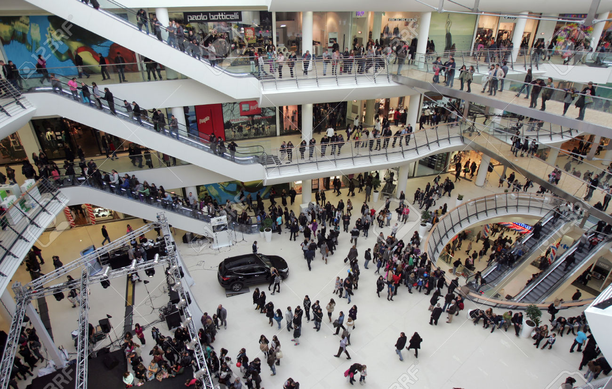
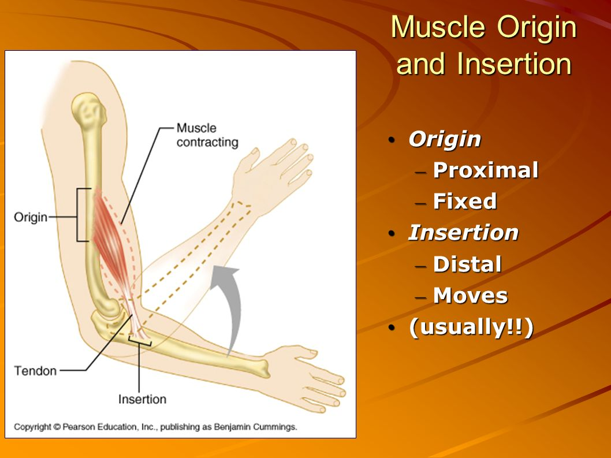
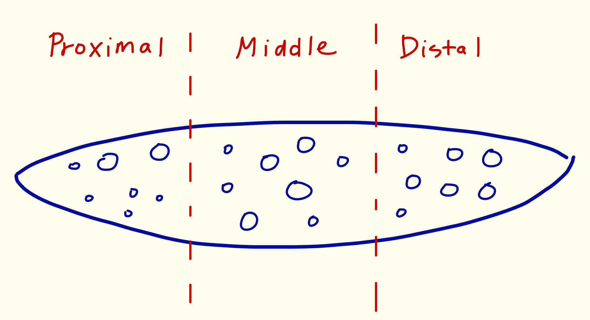
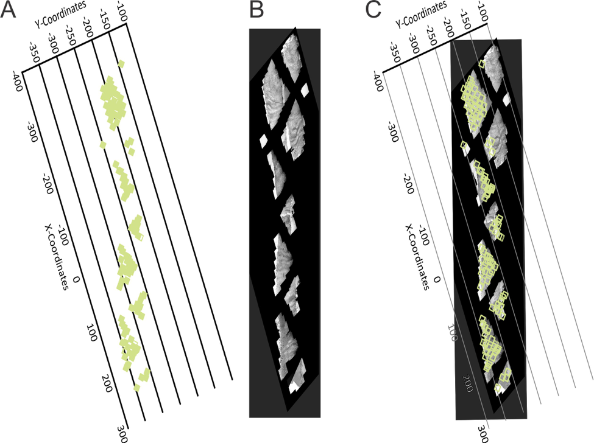
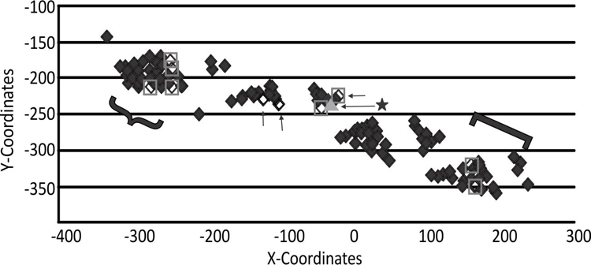
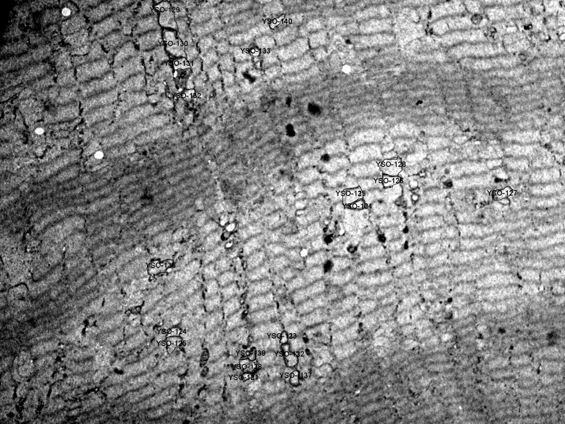

## <u>Overview</u>
1. Story about Size-Biased Data
2. Scientific Background for Mitochondria
3. Goals for this project: 
    * Whether Properties of mitochondria are different by locations. 
    * Suggestions on sampling scheme for future research. 
4. How Size-Biased Mitochondria Data came from? (Sampling Process)
5. Simulation Study 
6. Permutation Hypothesis Test and Boostrapping Confidence Interval 
7. Conclusion
8. Discussion 

--- .class #id 

## <u>Story about Size-Biased Data</u>
 
 

--- .class #id 

## <u>Scientific Background for Mitochondria</u>

--- .class #id 

## <u>Goals for this project: </u>

1. Whether Properties (area, perimeter, circularity and aspect ratio) of mitochondria are different by locations (proximal, middle and distal end). 
2. Suggestions on sampling scheme for future research. 

--- .class #id 

## <u>Sampling Process - 1</u>
* A young muscle fiber cell was magnifired to 166 different images by using Transmission Electron Microscope (TEM). 
 
 

--- .class #id 

## <u>Sampling Process - 2</u>
* Those falls in "{" are defined as beging in Proximal end, in "[" are being in Distal end, and the rest are being in Middle part.
 
 

--- .class #id 

## <u>Sampling Process - 3</u>
1. For each location, divide images into two groups: Subsarcolemmanl and Interfibrillar group. 
2. In each group, randomly pick one image.
3. In each image, randomly pick 20 mitochondria. 
  1. Generate a list of random coordinates. 
  2. If the area of mitochondria in the photo included one or more generated coordinates. 

--- .class #id 
## <u>References</u>
* Photo:
  1. Fishing net: [https://static01.nyt.com/images/2011/08/24/us/24trout_cnd/24trout_cnd-jumbo.jpg](https://static01.nyt.com/images/2011/08/24/us/24trout_cnd/24trout_cnd-jumbo.jpg)
  2. Mall : [https://previews.123rf.com/images/antonchalakov/antonchalakov1408/antonchalakov140800057/30920353-People-in-Shopping-Mall-in-Sofia-Bulgaria-Stock-Photo.jpg](https://previews.123rf.com/images/antonchalakov/antonchalakov1408/antonchalakov140800057/30920353-People-in-Shopping-Mall-in-Sofia-Bulgaria-Stock-Photo.jpg)
  3. Muscle : [http://images.slideplayer.com/27/9024081/slides/slide_3.jpg](http://images.slideplayer.com/27/9024081/slides/slide_3.jpg)

